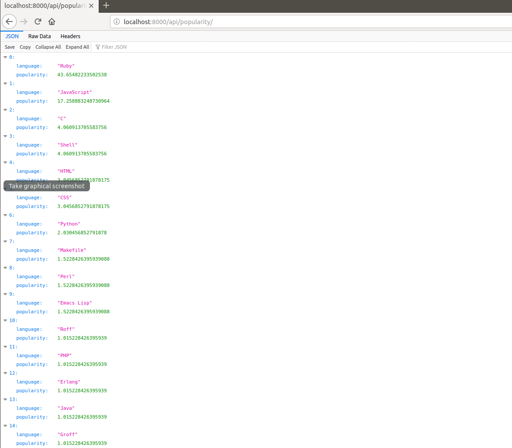
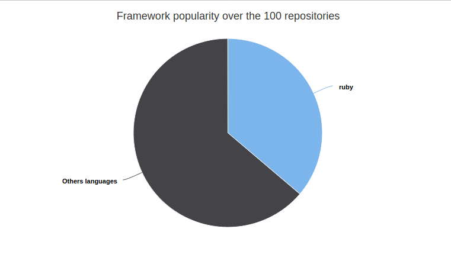
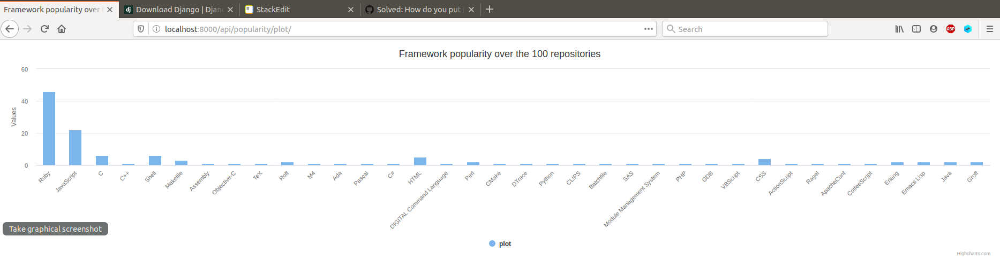

# REST microservice example using Django

<rb>

This is an example REST API uses [Django](https://www.djangoproject.com/). Has as objective is to list the languages used by the 100 trending public repositories on GitHub.

**This example is written with [python3](https://www.python.org/) and Django 3.2.7.**

<rb>

## Table of Contents

<rb>

1. [The objectives of the application](#obj)

2. [Building](#bui)

3. [Usage](#usg)

4. [Example with Ruby](#ruby)

<rb>

<a name="obj"></a>
## The objectives of the application

<rb>

1. This API allow you to the list the languages used by the 100 trending public repositories on GitHub.

2. Lists languages for a specific repository.

3. For each language, it calculates the attributes below:

	-	Number of repository using this language.

	-	The list of repository using the language.

	-	Framework popularity over the 100 repositories.

	-	Plot the results to interpret them

<rb>


<a name="bui"></a>
## Building

<rb>

It is best to use the python `virtualenv` tool to build locally:

```sh
$ git clone https://github.com/mahtat555/github-repo-analysis
$ cd github-repo-analysis
$ pip install virtualenv
$ virtualenv -p python3 venv
$ source venv/bin/activate
$ pip install -r requirements.txt
$ cd challenges
$ python manage.py migrate
$ python manage.py runserver
```

Then visit [http://localhost:8000/api](http://localhost:8000/api)
to view the app.

<rb>

<a name="usg"></a>
## Usage

1.  Index page

	Visit [http://localhost:8000/api/](http://127.0.0.1:8000/api/) or [http://localhost:8000/api/index/](http://127.0.0.1:8000/api/index/) to access the index page.

2. Help

	Visit [http://localhost:8000/api/help/](http://127.0.0.1:8000/api/help/)  to access the help page.

3.  List of repositories

	Visit [http://localhost:8000/api/repositories/](http://127.0.0.1:8000/api/repositories/) to access the list of 100 trending Github public repositories and the  languages they use.

4. Repository specified by `id`

	Visit [http://localhost:8000/api/repository/`id`/]() to access the repository specified by `id`.


	**Remark :  `id` - the repository number, is integer between 0 and 99.**

	<rb>

	*Example :*
		repository number 10 : [http://localhost:8000/api/repository/10/](http://localhost:8000/api/repository/10/)

5. Number of repositories using a language

	Visit [http://localhost:8000/api/number/?language=`language`/]() to access the number of repositories using a `language`.

	*for all languages :* Visit [http://localhost:8000/api/number/](http://127.0.0.1:8000/api/number/)

	*Example :*
		for Python language : [http://localhost:8000/api/number/?language=Python](http://localhost:8000/api/number/?language=Python)

6.  List of repositories using a language

	Visit [http://localhost:8000/api/list/?language=`language`]() to access the list of repositories using a `language`.

	*for all languages :* Visit [http://localhost:8000/api/list/](http://127.0.0.1:8000/api/list/)

	*Example :*
		for Python language : [http://localhost:8000/api/list/?language=Python](http://localhost:8000/api/list/?language=Python)

7. Framework popularity

	Visit [http://localhost:8000/api/popularity/?language=`language`]() to access the Framework popularity over the 100 repositories.

	*for all languages :* Visit [http://localhost:8000/api/popularity/](http://127.0.0.1:8000/api/popularity/)


	


	*Example :*
		for Python language : [http://localhost:8000/api/popularity/?language=Python](http://localhost:8000/api/popularity/?language=Python)

8. Plot the results to interpret them

	Visit [http://localhost:8000/api/plot/?language=`language`&type=`type`]() for  plot the results to interpret them.


	```
	 type is in ('pie', 'column', 'line', 'bar', 'scatter')
	 ```


	*for all languages :* Visit [http://localhost:8000/api/popularity/plot/](http://127.0.0.1:8000/api/popularity/plot/)


	*Example :*


    -	for Ruby language : [http://localhost:8000/api/plot/?language=Ruby&type=pie](http://localhost:8000/api/popularity/plot/?language=Ruby&type=pie)


      


    -	for all languages :   [http://localhost:8000/api/popularity/plot/](http://localhost:8000/api/popularity/plot/)


    <rb>




<rb>

<a name="ruby"></a>
## Example with Ruby

```ruby
## Example with Ruby for test the `BackEnd` Application

require "net/http"
require "json"


# Number of repositories using `Python`
puts "# Number of repositories using `Python`"
url = URI("http://localhost:8000/api/number/?language=Python")
response = Net::HTTP.get_response(url)
if response.code == '200'
  puts JSON(response.body)
else
  puts "Not found !!"
end

# List of repositories using `Python`
puts "\n# List of repositories using `Python`"
url = URI("http://localhost:8000/api/list/?language=Python")
response = Net::HTTP.get_response(url)
if response.code == '200'
  puts JSON(response.body)
else
  puts "Not found !!"
end

# `Python` popularity
puts "\n# `Python` popularity"
url = URI("http://localhost:8000/api/popularity/?language=Python")
response = Net::HTTP.get_response(url)
if response.code == '200'
  puts JSON(response.body)
else
  puts "Not found !!"
end
```
